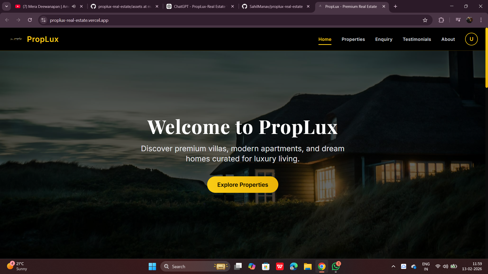
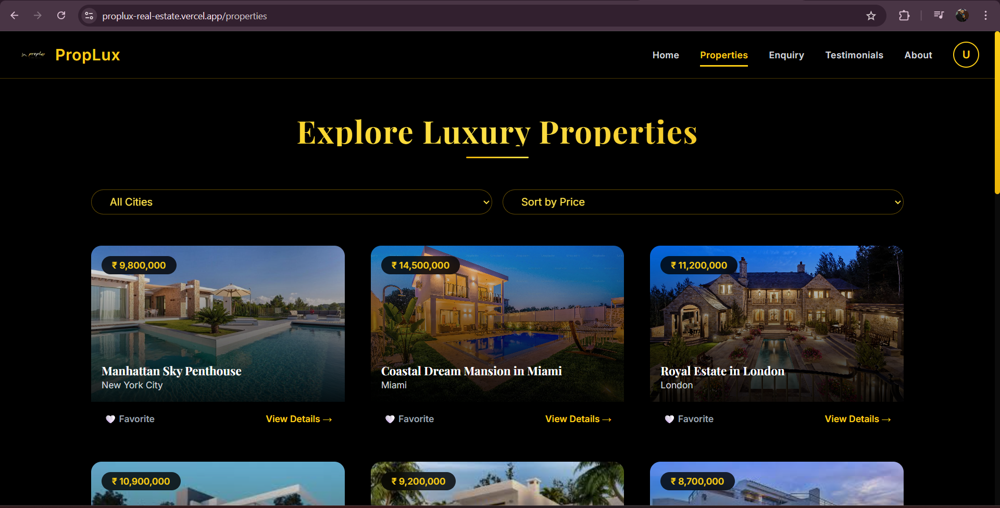
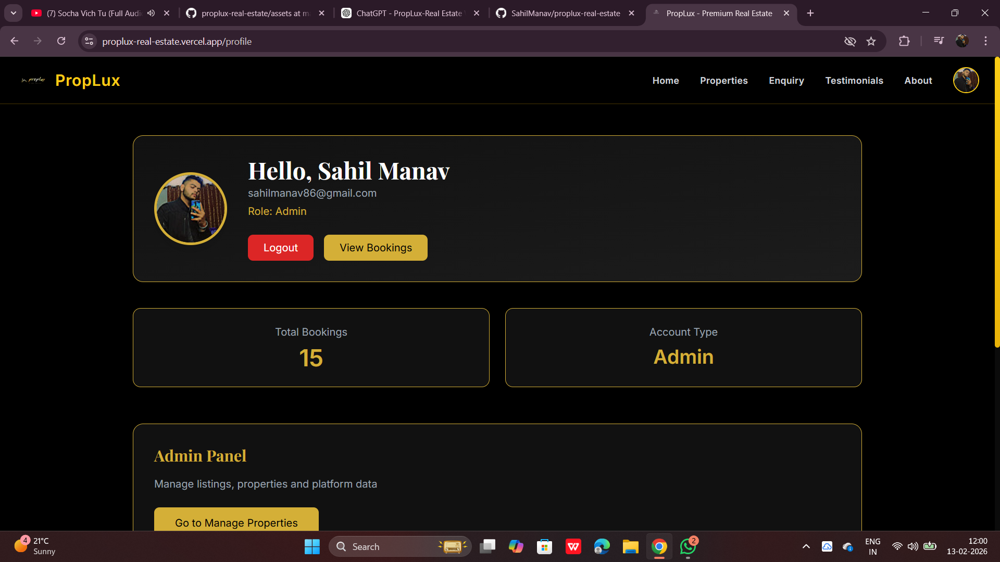

# 🏠 PropLux - Real Estate Web App

PropLux is a luxurious real estate web application built with the **MERN Stack** (MongoDB, Express.js, React.js, Node.js). It allows users to explore, book, and manage premium properties, while admins can manage listings and bookings via a dedicated admin panel.

🔗 **Live Demo:** https://proplux-real-estate.vercel.app/

---

## 🚀 Features

### 👤 User Side
- 🏡 View all listed properties
- 🔍 Filter properties by city or price
- 📄 Detailed property pages with image gallery, map, and specs
- 📦 Book properties (QR-based confirmation)
- 📧 Email confirmation on booking
- ❤️ Add to Favorites
- 👤 Google OAuth Login / Signup
- 🔐 Profile section with booking history and cancellation

### 🔧 Admin Side
- 👮 Admin login (email-based check)
- 🏠 Add, update, or delete properties
- 📥 View user enquiries
- 📑 View who favorited which properties
- 📊 Dashboard panel for control

---

## 🛠️ Tech Stack

| Technology | Description |
|------------|-------------|
| **Frontend** | React.js + Tailwind CSS |
| **Backend** | Node.js + Express.js |
| **Database** | MongoDB |
| **Authentication** | Google OAuth + JWT |
| **QR Code** | `qrcode.react` |
| **Email Service** | Web3Forms / NodeMailer |
| **Hosting** | Vercel (Frontend), Render (Backend) |

---

## 📸 Screenshots

### 🏠 Home Page

### 🏢 Property Detail Page

### 🛠 Admin Dashboard

---

## 📂 Project Structure
real-estate/
├── proplux-client/ # React frontend
├── server/ # Node.js backend
└── README.md

---

## 🧪 Setup Locally

### Frontend

cd proplux-client
npm install
npm run dev

Backend
cd server
npm install
npm run dev

🧑‍💻 Author

Sahil Manav
🎓 MCA Student, BCIIT College
🔗 LinkedIn: https://www.linkedin.com/in/sahil-manav-72473b229

📩 Email: sahilmanav86@gmail.com

